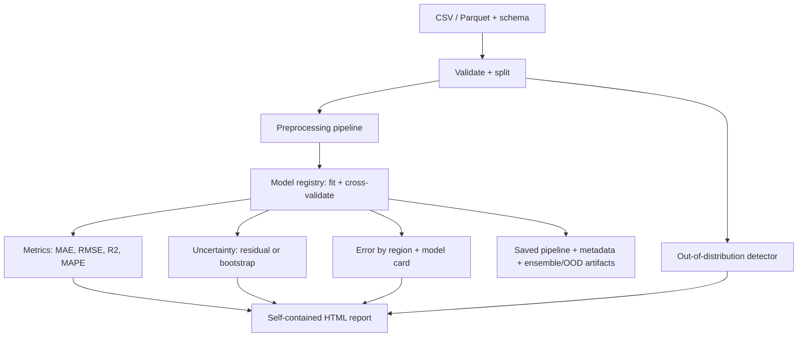

# surrogate-lab

A toolkit for training, comparing, and validating surrogate models for expensive simulations or
experiments — with an emphasis on **reliability**, not just predictive accuracy.

**Status: pre-alpha (v0.2.0 in progress).** Ingestion, schema validation, splitting,
preprocessing, training, cross-validation, metrics, self-contained HTML reporting,
bootstrap-ensemble and residual-based uncertainty, out-of-distribution detection, model cards,
and error-by-region analysis all work today. A served inference API is a later milestone — see
[docs/vision.md](docs/vision.md) for full scope and non-goals.

## What problem does this solve?

Running an expensive simulation (a CFD sweep, an FEA case, a physical experiment) thousands of
times to explore a design space is often too slow or costly. A surrogate model — a cheap
statistical stand-in trained on a sample of real simulation runs — lets you explore the rest of
the space fast. But a surrogate that reports a number without any sense of how much to trust it
is dangerous: it will happily extrapolate into regions it has never seen and answer with the
same confidence as it does in the middle of its training data. surrogate-lab trains, evaluates,
and reports on these models with that risk front and center, rather than only optimizing for the
lowest error metric.

## Who is it for?

Engineers and researchers who need a fast approximation of an expensive simulation or experiment
and want a repeatable, inspectable process for training it — not a research codebase, and not a
full MLOps platform.

## What makes it different?

- Built around **tabular, scikit-learn-compatible regression**, not a general AutoML framework.
- Every training run produces a **single self-contained HTML report** (no external files, no
  server) with parity plots, residual plots, a metrics comparison table, an error-by-region
  breakdown, an auto-generated model card, and an explicit, honestly-labeled uncertainty
  estimate — see [Uncertainty](#uncertainty) below.
- Two independent uncertainty methods, selected in config: residual-based (a single global
  interval) or bootstrap-ensemble (a per-point interval, at N times the training cost).
- Out-of-distribution detection flags predictions that fall outside the training data's
  feature ranges, are far from every training point, or (with the bootstrap method) get
  wildly disagreeing predictions from the ensemble — see
  [Out-of-distribution detection](#out-of-distribution-detection) below.
- Reproducibility is not an afterthought: one random seed controls the split, the models, and
  cross-validation, and the same config + data always produces the same split and metrics.

## Install

```bash
git clone https://github.com/NicholasTJL/surrogate-lab.git
cd surrogate-lab
pip install -e .
```

## Minimal example

```python
from pathlib import Path

import pandas as pd

from surrogate_lab.core.config import ExperimentConfig
from surrogate_lab.core.training import train_and_evaluate
from surrogate_lab.reporting.report import generate_report

df = pd.read_csv("data.csv")
config = ExperimentConfig(
    data={"path": "data.csv"},
    dataset_schema={"features": ["x1", "x2"], "target": "y"},
    models=["linear_regression", "random_forest"],
)
result = train_and_evaluate(df, config)
generate_report(result, Path("outputs/report.html"))
```

Or, via YAML and the CLI — see the 5-minute quickstart below.

## 5-minute quickstart

These commands are copy-paste exact and were run to verify this README. From a clean clone:

```bash
git clone https://github.com/NicholasTJL/surrogate-lab.git
cd surrogate-lab
python -m venv .venv

# Windows (PowerShell / Git Bash):
.venv\Scripts\pip install -e ".[dev]"
# macOS / Linux:
# .venv/bin/pip install -e ".[dev]"
```

Generate the synthetic example dataset (a cantilever-beam deflection model with injected noise;
no network access or proprietary data involved):

```bash
.venv\Scripts\python examples\beam_deflection\generate_data.py
```

Train three models and generate the HTML report:

```bash
.venv\Scripts\surrogate-lab train examples\beam_deflection\config.yaml
```

This writes `examples/beam_deflection/outputs/models/*.joblib` (one fitted pipeline per model)
and `examples/beam_deflection/outputs/report.html`. Open the report in a browser — it is a single
HTML file, so double-clicking it works with no server required.

Run predictions on new data with a saved model:

```bash
.venv\Scripts\surrogate-lab predict examples\beam_deflection\outputs\models\random_forest.joblib examples\beam_deflection\data.csv examples\beam_deflection\outputs\predictions.csv --interval
```

(On macOS/Linux, replace `.venv\Scripts\` with `.venv/bin/` throughout.)

More detail, including a bootstrap-uncertainty + Mahalanobis-distance variant of this example,
in [examples/beam_deflection/README.md](examples/beam_deflection/README.md).

## Workflow



`surrogate_lab.core.schema.DatasetSchema` declares your feature/target columns.
`surrogate_lab.core.data` loads CSV/Parquet and produces a reproducible train/validation/test
split. `surrogate_lab.core.preprocessing` builds a `ColumnTransformer`
(`StandardScaler` + `OneHotEncoder`) from that schema. `surrogate_lab.core.registry` maps model
names to scikit-learn estimators. `surrogate_lab.core.training` ties these together with
cross-validation, metrics, uncertainty, out-of-distribution detection, error-by-region analysis,
and model cards. `surrogate_lab.reporting` renders the result to HTML.

## Uncertainty

surrogate-lab supports two independent prediction-interval methods, selected in config via
`uncertainty.method`. Neither is full Bayesian or Gaussian-process uncertainty; both are
documented with their actual assumptions rather than presented as more rigorous than they are.

### Residual-based (`method: residual`, default)

Each trained model gets a single, global, symmetric interval half-width: the empirical quantile
of absolute residuals on the validation set, at a configured confidence level (default 90%). A
prediction's interval is then `[prediction - half_width, prediction + half_width]`, the same
half-width everywhere in feature space.

**Limitations:**

- Assumes residual magnitude is roughly constant across the input domain (homoscedastic). Real
  models are rarely this well-behaved, especially near the edges of the training data.
- Assumes the validation set represents the inputs you'll predict on later. It will under-cover
  in regions the model is locally worse at (extrapolation) and over-cover where it's locally
  better.
- It is a per-model, not per-prediction, uncertainty estimate.

### Bootstrap ensemble (`method: bootstrap`)

Trains `n_bootstrap_estimators` (default 30) copies of the model, each on a bootstrap resample
of the training data (bagging), and uses the spread of the ensemble's predictions at each point
as that point's interval. This is a genuine alternative, not a strictly better replacement:

- It gives a real per-point, heteroscedastic estimate — wider where the ensemble disagrees,
  narrower where it agrees — which the residual method cannot.
- It costs **N times the training time** of a single fit (N = `n_bootstrap_estimators`). In the
  `beam_deflection` example, training linear regression and random forest with 30 bootstrap
  members each took about 35 seconds total on a laptop, versus under 10 seconds for the
  equivalent residual-method run.
- It does **not** capture model-form uncertainty: if the chosen model type is a poor fit for the
  underlying relationship, every ensemble member can still agree with each other while being
  collectively wrong, producing a falsely narrow interval.
- In the `beam_deflection` example, the random forest's bootstrap interval under-covered its
  90% target noticeably (empirical test coverage around 54% in one run) — a genuine finding
  from running the method, not a hypothetical, and a reminder to check the report's empirical
  coverage number rather than trust the nominal confidence level.

Neither method by itself detects out-of-distribution inputs. Both do surface an interval width
you can sanity-check: the HTML report shows the empirical coverage of the fitted interval on the
held-out test set (e.g. a 90% interval that actually covers 60% of test points is a red flag).

## Out-of-distribution detection

For any new input, `surrogate_lab.core.ood` checks whether it falls outside the training data's
domain, using four independent, individually weak signals (any one flags the input):

1. **Feature range check** — a numeric feature outside `[min, max]` observed in training, or a
   categorical value never seen in training.
2. **Nearest-neighbour distance** (Euclidean by default, in standardized numeric feature space)
   — flags a point far from every training point, even if it's within range on each feature
   considered alone. The threshold is the `nn_distance_percentile` (default 95th) quantile of
   each training point's own leave-one-out nearest-neighbour distance: a heuristic tied to how
   spread out the training data already is, not a statistically derived bound.
3. **Mahalanobis distance** (`ood.distance_metric: mahalanobis`) — an alternative that accounts
   for correlation and scale between features, so two Euclidean-equidistant points aren't
   treated as equally unusual if the training data varies more along one axis than another.
   Needs at least 2 training rows; falls back to a pseudo-inverse (and should be treated with
   extra caution) when the training data's covariance is near-singular, e.g. two nearly
   perfectly correlated features.
4. **Ensemble disagreement**, only with `uncertainty.method: bootstrap` — high spread across
   ensemble members at a point is itself evidence the model is uncertain there.

A point can pass every check and still be a real extrapolation (e.g. a combination of feature
values that never actually co-occurred in training, that neither distance check happens to
flag). Treat `within_training_domain: true` as "no configured check raised a flag," not
"verified reliable."

`surrogate-lab predict --interval` runs this on every row by default (`--no-ood` to skip it) and
adds `within_training_domain`, `ood_warnings`, and `nearest_neighbor_distance` columns to the
output CSV. The HTML report shows the detector's calibrated thresholds and the training data's
ranges, so you can see what "in domain" means for that model.

## Model cards

Every model in the HTML report gets an auto-generated model card: training/validation/test row
counts, feature ranges, target range, model type and hyperparameters, validation metrics, and
plain-language limitations/intended-use/out-of-scope-use sections assembled from the actual
run's numbers (e.g. the bootstrap-vs-residual limitation text differs depending on which method
was actually used). Nothing in the card is hand-written boilerplate pasted into every run.

## Error analysis by data region

The report also breaks test-set MAE/RMSE down by quantile bin of a chosen feature, or of the
target itself (the default) — set via `error_analysis.region_feature`. This surfaces error
concentrated in one region that a single aggregate MAE/RMSE would hide (e.g. "the model is much
worse for the top 10% of target values"). Bin counts on a typical test split are small, so
treat differences between bins as suggestive, not conclusive — no significance test is applied.

## Roadmap

- [x] CSV/Parquet ingestion, pydantic schema, reproducible split
- [x] Scikit-learn preprocessing, model registry, cross-validation
- [x] MAE/RMSE/R²/MAPE metrics
- [x] Self-contained HTML report with parity/residual plots and prediction intervals
- [x] CLI: `surrogate-lab train`, `surrogate-lab predict`
- [x] Bootstrap-ensemble uncertainty, alongside residual-based (v0.2.0)
- [x] Out-of-distribution detection: feature range, nearest-neighbour/Mahalanobis distance,
      ensemble disagreement (v0.2.0)
- [x] Model cards and error analysis by data region (v0.2.0)
- [ ] Gaussian-process uncertainty (deferred past v0.2.0; see docs/vision.md for why)
- [ ] FastAPI inference service, Docker image (v0.3.0)

Full roadmap: [docs/vision.md](docs/vision.md).

## Contributing

See [CONTRIBUTING.md](CONTRIBUTING.md).

## License

[MIT](LICENSE)
