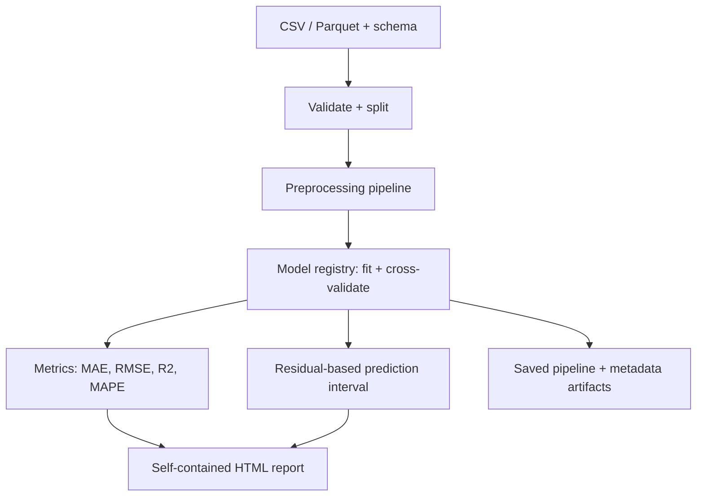

# surrogate-lab

A toolkit for training, comparing, and validating surrogate models for expensive simulations or
experiments — with an emphasis on **reliability**, not just predictive accuracy.

**Status: pre-alpha (v0.1.0 in progress).** Ingestion, schema validation, splitting,
preprocessing, training, cross-validation, metrics, and self-contained HTML reporting work
today. Out-of-distribution detection, model cards, and a served inference API are later
milestones — see [docs/vision.md](docs/vision.md) for full scope and non-goals.

## What problem does this solve?

Running an expensive simulation (a CFD sweep, an FEA case, a physical experiment) thousands of
times to explore a design space is often too slow or costly. A surrogate model — a cheap
statistical stand-in trained on a sample of real simulation runs — lets you explore the rest of
the space fast. But a surrogate that reports a number without any sense of how much to trust it
is dangerous: it will happily extrapolate into regions it has never seen and answer with the
same confidence as it does in the middle of its training data. surrogate-lab trains, evaluates,
and reports on these models with that risk front and center, rather than only optimizing for the
lowest error metric.

## Who is it for?

Engineers and researchers who need a fast approximation of an expensive simulation or experiment
and want a repeatable, inspectable process for training it — not a research codebase, and not a
full MLOps platform.

## What makes it different?

- Built around **tabular, scikit-learn-compatible regression**, not a general AutoML framework.
- Every training run produces a **single self-contained HTML report** (no external files, no
  server) with parity plots, residual plots, a metrics comparison table, and an explicit,
  honestly-labeled uncertainty estimate — see [Uncertainty](#uncertainty) below.
- Reproducibility is not an afterthought: one random seed controls the split, the models, and
  cross-validation, and the same config + data always produces the same split and metrics.

## Install

```bash
git clone https://github.com/NicholasTJL/surrogate-lab.git
cd surrogate-lab
pip install -e .
```

## Minimal example

```python
from pathlib import Path

import pandas as pd

from surrogate_lab.core.config import ExperimentConfig
from surrogate_lab.core.training import train_and_evaluate
from surrogate_lab.reporting.report import generate_report

df = pd.read_csv("data.csv")
config = ExperimentConfig(
    data={"path": "data.csv"},
    dataset_schema={"features": ["x1", "x2"], "target": "y"},
    models=["linear_regression", "random_forest"],
)
result = train_and_evaluate(df, config)
generate_report(result, Path("outputs/report.html"))
```

Or, via YAML and the CLI — see the 5-minute quickstart below.

## 5-minute quickstart

These commands are copy-paste exact and were run to verify this README. From a clean clone:

```bash
git clone https://github.com/NicholasTJL/surrogate-lab.git
cd surrogate-lab
python -m venv .venv

# Windows (PowerShell / Git Bash):
.venv\Scripts\pip install -e ".[dev]"
# macOS / Linux:
# .venv/bin/pip install -e ".[dev]"
```

Generate the synthetic example dataset (a cantilever-beam deflection model with injected noise;
no network access or proprietary data involved):

```bash
.venv\Scripts\python examples\beam_deflection\generate_data.py
```

Train three models and generate the HTML report:

```bash
.venv\Scripts\surrogate-lab train examples\beam_deflection\config.yaml
```

This writes `examples/beam_deflection/outputs/models/*.joblib` (one fitted pipeline per model)
and `examples/beam_deflection/outputs/report.html`. Open the report in a browser — it is a single
HTML file, so double-clicking it works with no server required.

Run predictions on new data with a saved model:

```bash
.venv\Scripts\surrogate-lab predict examples\beam_deflection\outputs\models\random_forest.joblib examples\beam_deflection\data.csv examples\beam_deflection\outputs\predictions.csv --interval
```

(On macOS/Linux, replace `.venv\Scripts\` with `.venv/bin/` throughout.)

More detail in [examples/beam_deflection/README.md](examples/beam_deflection/README.md).

## Workflow



`surrogate_lab.core.schema.DatasetSchema` declares your feature/target columns.
`surrogate_lab.core.data` loads CSV/Parquet and produces a reproducible train/validation/test
split. `surrogate_lab.core.preprocessing` builds a `ColumnTransformer`
(`StandardScaler` + `OneHotEncoder`) from that schema. `surrogate_lab.core.registry` maps model
names to scikit-learn estimators. `surrogate_lab.core.training` ties these together with
cross-validation and metrics. `surrogate_lab.reporting` renders the result to HTML.

## Uncertainty

Prediction intervals in v0.1.0 are **residual-based, not full Bayesian or ensemble uncertainty**.
Each trained model gets a single, global, symmetric interval half-width: the empirical quantile
of absolute residuals on the validation set, at a configured confidence level (default 90%). A
prediction's interval is then `[prediction - half_width, prediction + half_width]`, the same
half-width everywhere in feature space.

**Limitations** (documented, not hidden):

- Assumes residual magnitude is roughly constant across the input domain (homoscedastic). Real
  models are rarely this well-behaved, especially near the edges of the training data.
- Assumes the validation set represents the inputs you'll predict on later. It will under-cover
  in regions the model is locally worse at (extrapolation) and over-cover where it's locally
  better.
- It is **not** an out-of-distribution or extrapolation detector — a point far outside the
  training domain gets the same interval width as one in the middle of it.
- It is a per-model, not per-prediction, uncertainty estimate.

The HTML report shows the empirical coverage of this interval on the held-out test set, so you
can sanity-check calibration (e.g. a 90% interval that actually covers 60% of test points is a
red flag). Bootstrap ensembles and Gaussian-process variance — which give per-point,
heteroscedastic estimates — are planned for v0.2.0 (see [docs/vision.md](docs/vision.md)).

## Roadmap

- [x] CSV/Parquet ingestion, pydantic schema, reproducible split
- [x] Scikit-learn preprocessing, model registry, cross-validation
- [x] MAE/RMSE/R²/MAPE metrics
- [x] Self-contained HTML report with parity/residual plots and residual-based prediction intervals
- [x] CLI: `surrogate-lab train`, `surrogate-lab predict`
- [ ] Bootstrap ensembles and Gaussian-process uncertainty (v0.2.0)
- [ ] Out-of-distribution / extrapolation detection, model cards (v0.2.0)
- [ ] FastAPI inference service, Docker image (v0.3.0)

Full roadmap: [docs/vision.md](docs/vision.md).

## Contributing

See [CONTRIBUTING.md](CONTRIBUTING.md).

## License

[MIT](LICENSE)
